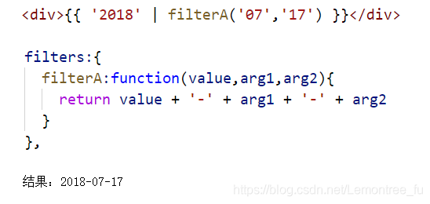
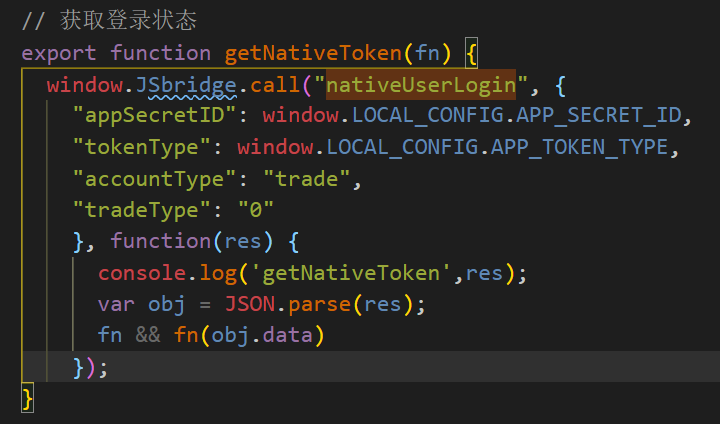
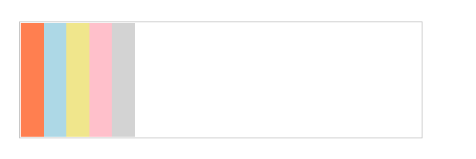
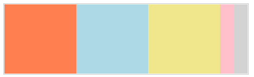
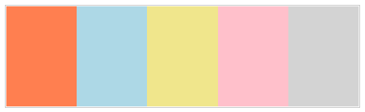
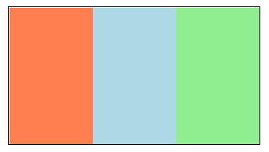

[toc]

# 2022.1.15

## vue中的$set


# 2022.1.22

## 一、Vue过滤器filter

简单介绍一下过滤器，顾名思义，过滤就是一个数据经过了这个过滤之后出来另一样东西，可以是从中取得你想要的，或者给那个数据添加点什么装饰，那么过滤器则是过滤的工具。

首先，过滤器可在new Vue实例前注册全局的，也可以在组件上写局部。

全局过滤器：

```json
Vue.filter(‘globalFilter’, function (value) {
return value + “!!!”
})
```

组件过滤器（局部）：

```js
filters:{
  componentFilter:function(value){
  return value + “!!!”
}
},
```

面有种写法有个需要注意的问题：全局注册时是filter，没有s的。而组件过滤器是filters，是有s的，这要注意了，虽然你写的时候没有s不报错，但是过滤器是没有效果的

简单介绍了一下过滤器的写法，后面会结合用法有更详细的讲解，下面我们来讲一下过滤器的使用方法

用法有二：

### 一，在双花括号插值

```
{{ 'ok' | globalFilter }}
```

### 二，在v-bind表达式中使用

```
<div v-bind:data="'ok' | globalFilter" ></div>
```

上面简单介绍了一下过滤器的调用，那么接下来我们讲解一下过滤器的参数写法

#### 一、message | filterA | filterB


上述代码中，message是作为参数传给filterA 函数，而filterA 函数的返回值作为参数传给filterB函数，最终结果显示是由filterB返回的。

#### 二、message | filterA(‘arg1’, arg2)



上述代码中，filterA的第一个参数是message，依次是‘arg1’,arg2

#### 三、‘a’,‘b’ | filterB

表示’a’和’b’分别作为参数传给filterB

# 2022.2.21

## 一、js如何让函数只调用一次？

最简单的方法

```js
//定义一个布尔类型

var flag = true;

// 在调用方法中用IF进行判断

if(flag ){  //此时Flag = true

test();  //此处为需要执行的函数

flag = false;  //函数执行完成再对Flag进行赋值，使其变为False

}

————————————————————————————————

//在执行第二次的时候 因为 Flag = false 的缘故，进而无法再进行函数的调用
```

## 二、[Vue之watch监听对象中某个属性的方法](https://www.cnblogs.com/jingxuan-li/p/11817329.html)

新建 userinfo = { name: "小明", age: "18" }

　**vue中watch监听name的方法**

　1. 可以结合计算属性的方法实现

```js
{
  ......
   watch: {
     nm () {
       console.log(this.nm)
     }
   },
    computed: {
      nm () { return this.userinfo.name }
   }
  ...... 
}
```

2. 可以通过配置 deep 为true实现

```js
// 监听对象的某个值
{
  ......
   watch: {
     'userinfo.name' () {
       console.log(this.nm)
     }
   }
  ......  
}

// 直接监听整个属性，消耗大
{
  ......
   watch: {
     userinfo () {
       handler () {
           console.log(this.nm)
       },
       deep: true
     }
   }
  ......  
}
```

# 2022.2.22

## 一、JavaScript Number.toFixed()函数

toFixed() 方法可把 Number 四舍五入为指定小数位数的数字。

**语法**

```
NumberObject.toFixed(num)
```

| 参数 | 描述                                                                                                                    |
| :--- | :---------------------------------------------------------------------------------------------------------------------- |
| num  | 必需。规定小数的位数，是 0 ~ 20 之间的值，包括 0 和 20，有些实现可以支持更大的数值范围。如果省略了该参数，将用 0 代替。 |

## 二、JavaScript parseFloat() 函数

parseFloat() 函数可解析一个字符串，并返回一个浮点数。

该函数指定字符串中的首个字符是否是数字。如果是，则对字符串进行解析，直到到达数字的末端为止，然后以数字返回该数字，而不是作为字符串。

可以用于去掉多余的小数点后的0。

**语法**

parseFloat(string)

| 参数   | 描述                     |
| :----- | :----------------------- |
| string | 必需。要被解析的字符串。 |

**注意：** 字符串中只返回第一个数字。

**注意：** 开头和结尾的空格是允许的。

**注意：** 如果字符串的第一个字符不能被转换为数字，那么 parseFloat() 会返回 NaN。

```js
使用 parseFloat() 来解析不同的字符串：

document.write(parseFloat("10") + "<br>");
document.write(parseFloat("10.33") + "<br>");
document.write(parseFloat("34 45 66") + "<br>");
document.write(parseFloat(" 60 ") + "<br>");
document.write(parseFloat("40 years") + "<br>");
document.write(parseFloat("He was 40") + "<br>");
以上实例输出结果:

10
10.33
34
60
40
NaN
```

## 三、格式化数字最多保留4位小数

```js
/**

 \* 格式化数字最多保留4位小数

 \* @param {*} number 需要格式化的数

 */

 let maxDecimal = (number) => {

 return String(number).replace(/^(.*\..{4}).*$/, "$1")

}


console.log(maxDecimal(12.3321432)) // 12.3321

console.log(maxDecimal(12.15)) // 12.15

console.log(maxDecimal(12)) // 12

console.log(maxDecimal(12.5200000))//12.52

console.log(maxDecimal(12.000))//12

console.log(maxDecimal(12.00000))//12

console.log(maxDecimal(3.1415926))//3.1415
```

# 2022.3.10

## 一、vue-router用法

```js
/<span class="detail" @click="goToDetail(item.id)">详情</span>

//点击事件
    goToDetail(id) {
      this.$router.push({
        name: 'PlansDetail',
        params: {
          id: content.entrust_no
        },
      });
    }
  // router.js
      {
    component: () => import('@/views/plansDetail/index.vue'),
    name: 'PlansDetail',
    path: '/plansDetail/:id',
    beforeEnter: (to, from, next) => {
      store.dispatch('setHeader', {
        title: '激励计划详情',
        visible: true
      });
      next();
    },
  }

//获取path中的参数
this.$route.params.id
```

# 2022.3.15

## CSS选择器（less）

```css
<div class="search-btn"></div>
<div class="search-btn another"></div>
<div class="search-btn">
        <div @click="clickSearchBtn">查询</div>
        <div @click="resetFormItemInfo('formItem')">重置</div>
</div>
.search-btn {
        display: flex;
        justify-content: flex-end;
        position: relative;
        &.another {
          position: absolute;
          top: 16px;
          right: 16px;
        }
        div:first-child {
        }
        div:last-child {
        }
}
```

# 2022.3.16

# $ 和 $route的区别

1.router是VueRouter的一个对象，通过Vue.use(VueRouter)和VueRouter构造函数得到一个router的实例对象，这个对象中是一个全局的对象，他包含了所有的路由包含了许多关键的对象和属性。

```
$router.push({path:'home'});本质是向history栈中添加一个路由，在我们看来是 切换路由，但本质是在添加一个history记录

$router.replace({path:'home'});//替换路由，没有历史记录
```

2.route是一个跳转的路由对象，每一个路由都会有一个route对象，是一个局部的对象，可以获取对应的name,path,params,query等

# 2022.3.15

## 一、github更改分支名称

第一步：先修改本地分支重命名

```bash
 git branch -m old new

示例：将galaxy分支修改为chinastock

#git branch -m galaxy chinastock


```

第二步：删除远程分支

```
git push origin :远程分支名
(你要删除的远程分支名,冒号前是空的，相当于用空的内容去抹掉远程分支)

示例:

#git push origin :galaxy
```

第三步：将本地分支推送到远程分支上，如果远程分支不存在，则创建此远程分支

```
git push origin 本地分支名:远程分支名
示例：

#git push origin chinastock

```

# 2022.3.29

## 一、json类型字符串转为js对象

`var obj = JSON.parse(str);`

## 二、fn && fn()

`fn && fn()`是 `if (fn) fn()`的优化。`&&`在JavaScript是 *短路* ，这意味着如果左侧是 `false`，则根本不评估右侧。这就是为什么 `fn && fn()`是安全的，即使 `fn`有错（`null`，`undefined`等）。

## 三、闭包

闭包的概念:函数中有另一个函数,或者是一个函数中有另一个对象,里面的函数或者是对象都可以使用外面函数中定义的变量或者数据,此时形成闭包
闭包的模式:函数模式的闭包,对象模式的闭包
闭包的作用:缓存数据,延长作用域链

* 函数模式的闭包：在一个函数中有一个函数

```js
   function f1() {
     var num=10;
     //函数的声明
     function f2() {
       console.log(num);
     }
     //函数调用
     f2();
   }
   f1();

```

* 对象模式的闭包：函数中有一个对象，这个对象能访问函数中的变量，就形成了闭包

```js
   function f3() {
     var num=10;
     var obj={
       age:num
     };
     console.log(obj.age);//10
   }
   f3();

```

## 四、如何获取闭包内的变量

传入一个函数，将变量作为入参给这个函数， 在这个函数内部接收这个变量。



```js
mounted() {
    setTimeout(() => {
      window.JSbridge = getJsBridge();
      setNativeTitle();
      getNativeToken(this.logToken);
    }, 500);
  },
  methods: {
    logToken(val) {
      this.nativeData = val;
    }
}
```

# 2022.3.31

## CSS **flex-grow** 属性

flex-grow属性定义***有多余的空间时***是否允许弹性元素增大，以及允许增大且有多余的空间时，相对于其他同辈弹性元素以什么比例增大。

取值是数字，负数无效，可以不用整数，只要大于或等于0就行，这个属性值决定弹性增长因子，决定分配弹性容器的可用空间时相对其他同辈弹性元素能增大多少。

如果弹性容器中***有多余的空间***，多出的空间将根据各弹性元素的非零增长因子***按比例分配给各个弹性元素***。

示例：

首先准备弹性容器和弹性元素：

```html
#main {
  width: 350px;
  height: 100px;
  border: 1px solid #c3c3c3;
  display: flex;
}
#main div {
  width: 20px;
}
<div id="main">
  <div style="background-color:coral;"></div>
  <div style="background-color:lightblue;"></div>
  <div style="background-color:khaki;"></div>
  <div style="background-color:pink;"></div>
  <div style="background-color:lightgrey;"></div>
</div>
```



```css
#main div:nth-of-type(1) {flex-grow: 1;}
#main div:nth-of-type(2) {flex-grow: 1;}
#main div:nth-of-type(3) {flex-grow: 1;}
```

### 示例1：弹性元素有宽度给部分弹性元素增加空间

350-20*5 = 150

150*(1+1+1) = 50

所以前三个弹性元素再增加50px，后面的没有设置就还是默认的20px



### 示例2：弹性元素没有宽度

没有宽度并且每个都设置flex-grow属性，这样就是平均分父元素的空间

```css
#main {
  width: 350px;
  height: 100px;
  border: 1px solid #c3c3c3;
  display: flex;
}

#main div:nth-of-type(1) {flex-grow: 1;}
#main div:nth-of-type(2) {flex-grow: 1;}
#main div:nth-of-type(3) {flex-grow: 1;}
#main div:nth-of-type(4) {flex-grow: 1;}
#main div:nth-of-type(5) {flex-grow: 1;}
```



PS：设置 1 1 2 和 设置 0.5 0.5 1的效果是一样的。

## CSS flex属性

flex 属性用于设置或检索弹性盒模型对象的子元素如何分配空间。

flex 属性是 flex-grow、flex-shrink 和 flex-basis 属性的简写属性。

```css
#main
{
	width:220px;
	height:120px;
	border:1px solid black;
	display:flex;
}

#main div
{
	flex:1;
}
<div id="main">
  <div style="background-color:coral;"></div>
  <div style="background-color:lightblue;"></div>  
  <div style="background-color:lightgreen;"></div>
</div>
```



| 值              | 描述                                                                                                      |
| --------------- | --------------------------------------------------------------------------------------------------------- |
| *flex-grow*   | 一个数字，规定项目将相对于其他灵活的项目进行扩展的量。                                                    |
| *flex-shrink* | 一个数字，规定项目将相对于其他灵活的项目进行收缩的量。                                                    |
| *flex-basis*  | 项目的长度。合法值："auto"、"inherit" 或一个后跟 "%"、"px"、"em" 或任何其他长度单位的数字。               |
| auto            | 与 1 1 auto 相同。                                                                                        |
| none            | 与 0 0 auto 相同。                                                                                        |
| initial         | 设置该属性为它的默认值，即为 0 1 auto。请参阅[*initial*](https://www.runoob.com/cssref/css-initial.html)。 |
| inherit         | 从父元素继承该属性。请参阅[*inherit*](https://www.runoob.com/cssref/css-inherit.html)。                    |

## CSS flex-shrink属性

flex-shrink 属性指定了 flex 元素的收缩规则。flex 元素仅在默认宽度之和大于容器的时候才会发生收缩，其收缩的大小是依据 flex-shrink 的值。

```html
<style>
#content {
  display: flex;
  width: 500px;
}

#content div {
  flex-basis: 120px;
  border: 3px solid rgba(0,0,0,.2);
}

.box { 
  flex-shrink: 1;
}

.box1 { 
  flex-shrink: 2; 
}
</style>
</head>
<body>
<p>div 总宽度为 500px, flex-basic 为 120px。</p>
<p>A, B, C 设置 flex-shrink:1。 D , E 设置为 flex-shrink:2</p>
<p>D , E 宽度与 A, B, C 不同</p>
<div id="content">
  <div class="box" style="background-color:red;">A</div>
  <div class="box" style="background-color:lightblue;">B</div>
  <div class="box" style="background-color:yellow;">C</div>
  <div class="box1" style="background-color:brown;">D</div>
  <div class="box1" style="background-color:lightgreen;">E</div>
</div>
</body>
</html>
```


**实例解析：**

flex-shrink的默认值为1，如果没有显示定义该属性，将会自动按照默认值1在所有因子相加之后计算比率来进行空间收缩。

本例中A、B、C 显式定义了 flex-shrink 为 1，D、E 定义了 flex-shrink 为 2，所以计算出来总共将剩余空间分成了 7 份，其中 A、B、C 占 1 份，D、E 占 2 份，即1:1:1:2:2

我们可以看到父容器定义为 500px，子项被定义为 120px，子项相加之后即为 600 px，超出父容器 100px。那么超出的 100px 需要被 A、B、C、D、E 消化 通过收缩因子，所以加权综合可得 **`100*1+100*1+100*1+100*2+100*2=700px`**。

于是我们可以计算 A、B、C、D、E 将被移除的溢出量是多少：

```
A 被移除溢出量：(100*1/700)*100，即约等于14px
B 被移除溢出量：(100*1/700)*100，即约等于14px
C 被移除溢出量：(100*1/700)*100，即约等于14px
D 被移除溢出量：(100*2/700)*100，即约等于28px
E 被移除溢出量：(100*2/700)*100，即约等于28px
```

最后A、B、C、D、E的实际宽度分别为：`120-14=106px, 120-14=106px, 120-14=106px, 120-28=92px,120-28=92px`，此外，这个宽度是包含边框的。

## CSS flex-basis属性

flex-basis 属性用于设置或检索弹性盒伸缩基准值。。

| *number* | 一个长度单位或者一个百分比，规定灵活项目的初始长度。                                       |
| ---------- | ------------------------------------------------------------------------------------------ |
| auto       | 默认值。长度等于灵活项目的长度。如果该项目未指定长度，则长度将根据内容决定。               |
| initial    | 设置该属性为它的默认值。请参阅[*initial*](https://www.runoob.com/cssref/css-initial.html)。 |
| inherit    | 从父元素继承该属性。请参阅[*inherit*](https://www.runoob.com/cssref/css-inherit.html)。     |

## CSS属性前的 -webkit, -moz

在CSS属性能中，我们常常能看到-webkit-，-moz-之类的前缀，这种就叫做浏览器私有前缀，是浏览器对于新CSS属性的一个提前支持。-webkit-是webkit内核的，-moz-是Firefox Gecko内核，moz代表的是Firefox的开发商Mozilla。
	为什么要有私有前缀呢？因为制定HTML和CSS标准的组织W3C动作是很慢的。通常，有w3c组织成员提出一个新属性，比如说圆角border-radius，大家都觉得好，但是w3c不会为这个属性制定标准，而是要走很复杂的程序，经过很多审查。而浏览器商不愿意等那么久，他们觉得一个属性已经够成熟了，就会在浏览器中加入支持。但是避免日后w3c公布标准时有所变更，就会加入一个私有前缀，比如-webkit-border-radius，通过这种方式来提前支持新属性，等到日后w3c公布了标准，border-radius的标准写法确立之后，再让新版的浏览器支持border-radius这种写法。
	比方说，Chrome 10是不认border-radius这种写法的，只能用webkit-border-radius，而Chrome12就能认了。于是在写CSS的时候，这样写就能确保Chrome10和Chrome12浏览网页的时候都能够正确显示。

# 2022.4.1

## 一、Vuex的基本使用

### 1.安装vuex依赖包

```
npm install vuex --save
```

### 2.导入vux包

```
import Vuex from 'vux'
Vue.use(Vuex)
```

### 3.创建store对象

```
const store = new Vuex.store({
//state中存放就是全局共享的数据
  state:{}
})
```

### 4.将store对象挂载到vue实例中

```js
new Vue({
el: '#app',
render:h=>h(app),
router,
//将创建的共享数据对象，挂载到Vue实例中
//所有的组件，就可以直接从store中获取全局的数据了
store
})
```

### 5.创建state数据源

state提供唯一的公共数据源，所有共享的数据都要统一放到Store的State中进行存储

```js
const store = new Vuex.store({
  state: {
      count:0
    }
})
```

**组件访问State的方式**

第一种：

`this.$store.state.全局数据名称`

第二种：

```js
// 从vuex中按需导入mapState函数
import {mapState} from 'vuex'
// 通过刚才导入的mapState函数，将当前组件需要的全局函数，映射为当前组建的 computed计算属性
  computed: {
    ...mapState(['count'])
  }
```

### 6.更改store中的数据

Mutation勇于变更Store中的数据。

* 只能通过mutation变更store数据，不可以直接操作store中的数据。
* 通过这种方式虽然操作起来稍微繁琐，但是可以集中监控所有数据的变化。（如果在某个vue文件里使用store.state.变量 赋值或操作的方式，那么将来项目大了，你想知道这个数据在哪个文件里发生了变化则需要挨个vue查找)

# 2022.4.8

## git下载指定分支下的代码

`git clone -b develop XX   其中develop就是分支的名称`

# 2022.4.14

## 一、filter 和find的区别

find 和 filter 都是不改变原数组的方法

但是find只查出第一个符合条件的结果接着就不遍历了，返回的是数组项，而filter返回全部符合某一条件的数组项组成的数组，返回项仍然是数组。

## 二、解构赋值

```js
// 原始写法
const obj = {
  a:1,
  b:2,
  c:3,
  d:4,
  e:5,
}
const a = obj.a;
const b = obj.b;
const c = obj.c;
const d = obj.d;
const e = obj.e;
const f = obj.a + obj.d;
const g = obj.c + obj.e;

// es6解构赋值写法
var obj = {
  a: 1,
  b: 2,
  c: 3,
  d: 4
}
var {a,c} = obj;
console.log(a,c); // 1, 3
// 想创建的变量名和对象的属性名不一致，可以这么写
var {b:b1, d:d1} = obj
console.log(b1, d1);// 2, 4

const {a,b,c,d} = obj;
const f = a + d;
const g = c + b;

// ES6的解构赋值虽然好用。但是要注意解构的对象不能为undefined、null。否则会报错。

```

## 三、扩展运算符

```js

const a = [1,2,3];
const b = [1,5,6];
const c = a.concat(b);//[1,2,3,1,5,6]

const obj1 = {
  a:1,
}
const obj2 = {
  b:1,
}
const obj = Object.assign({}, obj1, obj2);//{a:1,b:1}

// 较复杂且数组没去重

const a = [1,2,3]
const b = [1,5,6]
const c =[...new Set([...a,...b])]
console.log(c); // [ 1, 2, 3, 5, 6 ]

const obj1 = {
  a:1,
}
const obj2 = {
  b:1,
}
const obj = {...obj1,...obj2};//{a:1,b:1}
```

## 四、模板字符串

```javascript
// 使用模板字符串
const name = '小明';
const score = 69;
let result = '';
if(score > 60){
  result = `${name}的考试成绩及格`; 
}else{
  result = `${name}的考试成绩不及格`; 
}

// 像你们这样用ES6字符串模板，还不如不用，你们根本不清楚在${}中可以做什么操作。在${}中可以放入任意的JavaScript表达式，可以进行运算，以及引用对象属性。

const name = '小明';
const score = 59;
const result = `${name}${score > 60?'的考试成绩及格':'的考试成绩不及格'}`;
// 或者
const result = `${name}的考试成绩${score > 60?'':'不'}及格`;

```

## 五、includes

```js
// 关于if中判断条件的吐槽

if(
  type == 1 ||
  type == 2 ||
  type == 3 ||
  type == 4 
){
 //...
}
// 使用ES6中数组实例方法includes

const condition = [1,2,3,4];

if( condition.includes(type) ){
   //...
}

```

## 六、可选链操作符

```javascript
// 如果读取对象内部的某个属性，往往需要判断一下，属性的上层对象是否存在。
const name = obj && obj.name;
// 比如，读取message.body.user.firstName这个属性，安全的写法是写成下面这样。
// 错误的写法
const  firstName = message.body.user.firstName || 'default';
// 正确的写法
const firstName = (message
  && message.body
  && message.body.user
  && message.body.user.firstName) || 'default';

  // 上面例子中，firstName属性在对象的第四层，所以需要判断四次，每一层是否有值。
  // 这样的层层判断非常麻烦，因此 ES2020 引入了“链判断运算符”（optional chaining operator）?.，简化上面的写法。
  const name = obj?.name;
  const firstName = message?.body?.user?.firstName || 'default';
  // 上面代码使用了?.运算符，直接在链式调用的时候判断，左侧的对象是否为null或undefined。如果是的，就不再往下运算，而是返回undefined。

  // 下面是判断对象方法是否存在，如果存在就立即执行的例子。
  iterator.return?.()

  // 链判断运算符?.有三种写法。
obj?.prop // 对象属性是否存在
obj?.[expr] // 同上
func?.(...args) // 函数或对象方法是否存在
```

## 七、Null判断运算符

读取对象属性的时候，如果某个属性的值是 `null`或 `undefined`，有时候需要为它们指定默认值。常见做法是通过 `||`运算符指定默认值。

```javascript
const headerText = response.settings.headerText || 'Hello, world!';
const animationDuration = response.settings.animationDuration || 300;
const showSplashScreen = response.settings.showSplashScreen || true;
```

上面的三行代码都通过 `||`运算符指定默认值，但是这样写是错的。开发者的原意是，只要属性的值为 `null`或 `undefined`，默认值就会生效，但是属性的值如果为空字符串或 `false`或 `0`，默认值也会生效。

为了避免这种情况，[ES2020](https://github.com/tc39/proposal-nullish-coalescing) 引入了一个新的 Null 判断运算符 `??`。它的行为类似 `||`，但是只有运算符左侧的值为 `null`或 `undefined`时，才会返回右侧的值。

```javascript
const headerText = response.settings.headerText ?? 'Hello, world!';
const animationDuration = response.settings.animationDuration ?? 300;
const showSplashScreen = response.settings.showSplashScreen ?? true;
```

上面代码中，默认值只有在左侧属性值为 `null`或 `undefined`时，才会生效。

这个运算符的一个目的，就是跟链判断运算符 `?.`配合使用，为 `null`或 `undefined`的值设置默认值。

```javascript
const animationDuration = response.settings?.animationDuration ?? 300;
```

上面代码中，如果 `response.settings`是 `null`或 `undefined`，或者 `response.settings.animationDuration`是 `null`或 `undefined`，就会返回默认值300。也就是说，这一行代码包括了两级属性的判断。

# 2022.4.21

## 一、promise

1. promise没有被 `resolve`或者 `reject`，状态是 `pending。`
2. promise.then()返回一个新的promise实例，因此可以采用链式写法，即 `then`方法后面再调用另一个 `then`方法。
3. 第一个回调函数then完成以后，会将返回结果作为参数，传入第二个then回调函数。
4. 状态改变才会触发then绑定的回调函数。
5. `Promise.resolve()`方法可以将现有对象转为 Promise 对象。

# 2022.5.13

## 一、git pull 报错Your configuration specifies to merge with the XXX from the remote, but no such ref was fetched

翻译过来的大致意思是：
你的配置指定与ref 'XXX'合并
从远程，但没有这样的引用。
打开.git文件夹
打开config文件

```bash
    [branch "master"]
	remote = origin
	merge = refs/heads/XXX
```

上诉XXX应该和 branch后面的分支名称保持一致。如果不一致就会报错，更改之后，git pull就成功了。

## 二、vue-router 跳转页面后携带数据但不展示在URL里

```js
    getDetails(content) {
      this.$router.push({
        path: '/exerciseDetail',
        name: 'ExerciseDetail',
        params: {
          item: content,
        }
      });
    }
```

## 三、css 文字溢出处理

### 1. 强制一行溢出显示省略号

```css
overflow:hidden;//超出的隐藏

text-overflow:ellipsis;//显示省略符号来代表被修剪的文本。

white-space:nowrap;//不换行
```

### 2. 两行或多行文本最多展示两行溢出显示省略号

```
overflow: hidden;

text-overflow: ellipsis;

display: -webkit-box;

-webkit-line-clamp: 2; //多行在这里修改数字即可

overflow:hidden;

/* autoprefixer: ignore next */

-webkit-box-orient: vertical;
```

# 2022.5.18

## 一、Date.now的用法

Date.now()是javascript中的内置函数，它返回自1970年1月1日00:00:00 UTC以来经过的毫秒数。

```
const A = Date.now();
console.log(A); //1652841643429
//获取当前日期
const d = Date(Date.now());
console.log(d); //Wed May 18 2022 10:40:43 GMT+0800 (GMT+08:00)


```

## 二、TypeError: (0 , _api.default) is not a function，读取不到import的方法报错

import的格式写错了，导入方法的时候，方法应该用大括号括起来

```
import getNoticeInfo from '@/api/api.js'
import {getNoticeInfo} from '@/api/api.js'
```

## 三、js判断条件里同时有|| 和&&怎么写\

用括号括起来

```
//比如在vue里面的v-for的里面的时候
v-if="!item.canReceiveAward &&(item.receiveStatus === 1 || item.receiveStatus === -1 )"
```


# 2022.6.13

## 一、动态绑定class

### 对象语法

```html
用法一：直接通过{}绑定一个类
<h2 :class="{'active': isActive}">Hello World</h2>

用法二：也可以通过判断，传入多个值
<h2 :class="{'active': isActive, 'line': isLine}">Hello World</h2>

用法三：和普通的类同时存在，并不冲突
注：如果isActive和isLine都为true，那么会有title/active/line三个类
<h2 class="title" :class="{'active': isActive, 'line': isLine}">Hello World</h2>

<div :class="{'active':isopen == 1,'common':isSecond}"></div>
<div :class="{'active':isopen == 1,'common':ture}"></div>
<div :class="{'active':isopen == 1,'common':1}"></div>


用法四：如果过于复杂，可以放在一个methods或者computed中
注：classes是一个计算属性
<h2 class="title" :class="classes">Hello World</h2>

```


### 数组语法

```html
用法一：直接通过{}绑定一个类
<h2 :class="['active']">Hello World</h2>
（1）数据和三元运算符结合：
<div :class="[isopen?'active':'active1']"></div>
<div :class="[isopen == 1?'active':'active1']"></div>


用法二：也可以传入多个值
<h2 :class=“[‘active’, 'line']">Hello World</h2>
（2）数组和对象结合：
<div :class="[isopen?'active':'active1',{'active1':isopen == 1}]"></div>
（3）数组和对象还有静态class结合：
<div :class="[isopen?'active':'active1',{'active1':isopen == 1},'item item1']"></div>
多个静态class用空格隔开
                                                                 

用法三：和普通的类同时存在，并不冲突
注：会有title/active/line三个类               
<h2 class="title" :class=“[‘active’, 'line']">Hello World</h2>

用法四：如果过于复杂，可以放在一个methods或者computed中
注：classes是一个计算属性
<h2 class="title" :class="classes">Hello World</h2>

```

# 2022.6.17

## 一、前端常见报错

1、`xxx is not defined`

xxx 没有定义


2、`xxx is not a function`

xxx 不是一个函数
xxx此时是undefined

3、`annot read property 'xxx' of undefined`

不能读取undefined的xxx属性

xxx前面的变量是undefined


4、`Cannot set property 'xxx' of null`

不能给null设置xxx属性

xxx前面的变量是null


5、`Invalid or unexpected token`

标点符号可能是中文

6、`Unexpected token a in JSON at position 0`

使用JSON.parse进行解析json字符串时，解析的内容不合法

7、`XMLHttpRequest cannot load http://XXXXXX. No 'Access-Control-Allow-Origin' header is present on the requested resource. Origin 'http://XXXXXX' is therefore not allowed access.`

使用ajax请求数据时，产生跨域了

8、`Illegal break statement`

出现了非法语句


9、`SyntaxError(语法错误)`

SyntaxError是解析代码时发生的语法错误
// 变量名错误
var 1a;
// 缺少括号
console.log ('hello';

10、`ReferenceErro（引用错误）`

ReferenceError是引用一个不存在的变量时发生的错误。

unknownVariable
// ReferenceError: unknownVariable is not defined

另一种触发场景是，将一个值分配给无法分配的对象，比如对函数的运行结果或者this赋值。

console.log() = 1
// ReferenceError: Invalid left-hand side in assignment this = 1
// ReferenceError: Invalid left-hand side in assignment

上面代码对函数console.log的运行结果和this赋值，结果都引发了ReferenceError错误

11、`RangeError（范围错误）`

RangeError是当一个值超出有效范围时发生的错误。主要有几种情况，一是数组长度为负数，二是Number对象的方法参数超出范围，以及函数堆栈超过最大值。

new Array(-1)
// RangeError: Invalid array length
(1234).toExponential(21)
// RangeError: toExponential() argument must be between 0 and 20

12、`TypeError（类型错误）`

TypeError是变量或参数不是预期类型时发生的错误。比如，对字符串、布尔值、数值等原始类型的值使用new命令，就会抛出这种错误，因为new命令的参数应该是一个构造函数。

new 123
//TypeError: number is not a func var obj = {}; obj.unknownMethod()
// TypeError: undefined is not a function

上面代码的第二种情况，调用对象不存在的方法，会抛出TypeError错误。

13、`URIError（URI错误）`

URIError是URI相关函数的参数不正确时抛出的错误，主要涉及encodeURI()、decodeURI()、encodeURIComponent()、decodeURIComponent()、escape()和unescape()这六个函数。

decodeURI('%2')
// URIError: URI malformed

14、`EvalError（eval错误）`

eval函数没有被正确执行时，会抛出EvalError错误。该错误类型已经不再在ES5中出现了，只是为了保证与以前代码兼容，才继续保留。

以上这6种派生错误，连同原始的Error对象，都是构造函数。开发者可以使用它们，人为生成错误对象的实例。

new Error("出错了！");
new RangeError("出错了，变量超出有效范围！");
new TypeError("出错了，变量类型无效！");

上面代码表示新建错误对象的实例，实质就是手动抛出错误。可以看到，错误对象的构造函数接受一个参数，代表错误提示信息（message）。

15、错误举例

找不到引入的.js文件


引用的.js文件找不到，chrome报错信息如下：
`GET file:///D:/JavaBooks/js/jquery%20validation/src-gzh/jquery.validate-1.7.src net::ERR_FILE_NOT_FOUND`

可能原因：.js文件名字拼写错误（比如，少了文件后缀.js）

js函数缺少括号)，函数体缺少大括号}

如果函数缺少括号或者函数体缺少括号，浏览器debug时都会提示报错信息。这里分2种情况：
1、一般报错信息都在报在错误的地方，这种情况比较好说。
2、但是有的时候会报在其他的地方，这个时候要明白的是，报错信息缺少括号这一点是确定无疑的，现在就是要定位到具体是哪一行报错。

例如
报错函数/函数体缺少括号，报错的地方不是函数/函数体的末尾，而是报在调用该函数的地方。

css代码使用了//注释，导致有的div内容出不来，然后也不报错

css注释，只能使用/* 注释内容 */，而不能使用双斜杠//。

定义了多个同名的变量

浏览器会报错。

文档未加载完毕，就开始执行js代码导致的错误

文档/DOM未加载完毕，就开始执行js代码。

比如，js代码写在html代码的前面，而且document.getElementById('traffic')这样来访问DOM（即文档的元素），那么这个时候就会报TypeError: a is null（火狐浏览器，注：a变量没用，只会起误导作用）或者Uncaught TypeError: Cannot read property 'click2' of null（谷歌浏览器）。

js 对象的函数未定义

浏览器报错，说对象的函数未定义，这个时候可以肯定的一点是，当前这个对象是没有这个函数的。

比如，高德地图对象函数未定义，是因为地图对象被2.5维地图对象覆盖了。
出现这种bug时，问题在函数，往往是因为对象被重复定义，或者被重新赋值了。

# 2022.6.22

## 一、import和require的区别

今天看到项目里的一个js文件里有这样的代码:

```js
import store from '../store';
const allPermissionDefaultData = require('@assets/json/getUserPermissions.json');
```

突然产生了一个困惑：什么时候用import什么时候用require，它俩有什么区别呢？

### 区别1：模块加载的时间

require：运行时加载
import：编译时加载（效率更高）【由于是编译时加载，所以import命令会提升到整个模块的头部】

```js
test();
import { test} from '/test';
```

上面的代码不会报错，正常执行

### 区别2：模块的本质

require：模块**就是对象**，输入时必须查找对象属性
import：ES6 模块不是对象，而是通过 export 命令显式指定输出的代码，再通过 import 命令输入（这也导致了没法引用 ES6 模块本身，因为它不是对象）。由于 ES6 模块是编译时加载，使得静态分析成为可能。有了它，就能进一步拓宽 JavaScript 的语法，比如引入宏（macro）和类型检验（type system）这些只能靠静态分析实现的功能。

```js
// CommonJS模块
let { exists, readFile } = require('fs');
// 等同于
let fs = require('fs');
let exists = fs.exists;
let readfile = fs.readfile;

上面CommonJs模块中，实质上整体加载了fs对象（fs模块），然后再从fs对象上读取方法

// ES6模块
import { exists, readFile } from 'fs';
```

上面ES6模块，实质上从fs模块加载2个对应的方法，其他方法不加载

区别3：严格模式

CommonJs模块和ES6模块的区别：
（1）CommonJs模块默认采用非严格模式
（2）ES6 的模块自动采用严格模式，不管你有没有在模块头部加上 “use strict”;
（3）**CommonJS 模块输出的是一个值的拷贝，ES6 模块输出的是值的引用**，举例如下

```js
// m1.js
export var foo = 'bar';
setTimeout(() => foo = 'baz', 500);
// m2.js
import {foo} from './m1.js';
console.log(foo); //bar
setTimeout(() => console.log(foo), 500); //baz
```


ES6 模块之中，顶层的 this 指向 undefined ，即不应该在顶层代码使用 this

## 二、自定义指令

### 注册全局指令

```js
// 注册一个全局自定义指令 `v-focus`
Vue.directive('focus', {
  // 当被绑定的元素插入到 DOM 中时……
  inserted: function (el) {
    // 聚焦元素
    el.focus()
  }
})
```

### 注册局部指令

```js
directives: {
  focus: {
    // 指令的定义
    inserted: function (el) {
      el.focus()
    }
  }
}
```

### 钩子函数

一个指令定义对象可以提供如下几个钩子函数 (均为可选)：

- `bind`：只调用一次，指令第一次绑定到元素时调用。在这里可以进行一次性的初始化设置。
- `inserted`：被绑定元素插入父节点时调用 (仅保证父节点存在，但不一定已被插入文档中)。
- `update`：所在组件的 VNode 更新时调用，**但是可能发生在其子 VNode 更新之前**。指令的值可能发生了改变，也可能没有。但是你可以通过比较更新前后的值来忽略不必要的模板更新 (详细的钩子函数参数见下)。

- `componentUpdated`：指令所在组件的 VNode **及其子 VNode** 全部更新后调用。
- `unbind`：只调用一次，指令与元素解绑时调用。

### 钩子函数参数

指令钩子函数会被传入以下参数：

- `el`：指令所绑定的元素，可以用来直接操作 DOM。
- `binding`：一个对象，包含以下 property：
  - `name`：指令名，不包括 `v-` 前缀。
  - `value`：指令的**绑定值**，例如：`v-my-directive="1 + 1"` 中，绑定值为 `2`。
  - `oldValue`：指令绑定的前一个值，仅在 `update` 和 `componentUpdated` 钩子中可用。无论值是否改变都可用。
  - `expression`：字符串形式的指令表达式。例如 `v-my-directive="1 + 1"` 中，表达式为 `"1 + 1"`。
  - `arg`：传给指令的**参数**，可选。例如 `v-my-directive:foo` 中，参数为 `"foo"`。
  - `modifiers`：一个包含修饰符的对象。例如：`v-my-directive.foo.bar` 中，修饰符对象为 `{ foo: true, bar: true }`。
- `vnode`：Vue 编译生成的虚拟节点。移步 [VNode API](https://cn.vuejs.org/v2/api/#VNode-接口) 来了解更多详情。
- `oldVnode`：上一个虚拟节点，仅在 `update` 和 `componentUpdated` 钩子中可用。

除了 `el` 之外，其它参数都应该是只读的，切勿进行修改。

```
<div id="hook-arguments-example" v-demo:foo.a.b="message"></div>
Vue.directive('demo', {
  bind: function (el, binding, vnode) {
    var s = JSON.stringify
    el.innerHTML =
      'name: '       + s(binding.name) + '<br>' +
      'value: '      + s(binding.value) + '<br>' +
      'expression: ' + s(binding.expression) + '<br>' +
      'argument: '   + s(binding.arg) + '<br>' +
      'modifiers: '  + s(binding.modifiers) + '<br>' +
      'vnode keys: ' + Object.keys(vnode).join(', ')
  }
})

new Vue({
  el: '#hook-arguments-example',
  data: {
    message: 'hello!'
  }
})
```

### 动态指令参数

指令的参数可以是动态的。例如，在 `v-mydirective:[argument]="value"` 中，`argument` 参数可以根据组件实例数据进行更新！这使得自定义指令可以在应用中被灵活使用。

例如你想要创建一个自定义指令，用来通过固定布局将元素固定在页面上。我们可以像这样创建一个通过**指令值**来更新竖直位置像素值的自定义指令：

```js
<div id="baseexample">
  <p>Scroll down the page</p>
  <p v-pin="200">Stick me 200px from the top of the page</p>
</div>
Vue.directive('pin', {
  bind: function (el, binding, vnode) {
    el.style.position = 'fixed'
    el.style.top = binding.value + 'px'
  }
})

new Vue({
  el: '#baseexample'
})
```

这会把该元素固定在距离页面顶部 200 像素的位置。但如果场景是我们需要把元素固定在左侧而不是顶部又该怎么办呢？这时使用**动态参数**就可以非常方便地根据每个组件实例来进行更新。

```js
<div id="dynamicexample">
  <h3>Scroll down inside this section ↓</h3>
  <p v-pin:[direction]="200">I am pinned onto the page at 200px to the left.</p>
</div>
Vue.directive('pin', {
  bind: function (el, binding, vnode) {
    el.style.position = 'fixed'
    var s = (binding.arg == 'left' ? 'left' : 'top')
    el.style[s] = binding.value + 'px'
  }
})

new Vue({
  el: '#dynamicexample',
  data: function () {
    return {
      direction: 'left'
    }
  }
})
```

### 函数简写

在很多时候，你可能想在 `bind` 和 `update` 时触发相同行为，而不关心其它的钩子。比如这样写：

```
Vue.directive('color-swatch', function (el, binding) {
  el.style.backgroundColor = binding.value
})
```

### 对象字面量

如果指令需要多个值，可以传入一个 JavaScript 对象字面量。记住，指令函数能够接受所有合法的 JavaScript 表达式。

```
<div v-demo="{ color: 'white', text: 'hello!' }"></div>
Vue.directive('demo', function (el, binding) {
  console.log(binding.value.color) // => "white"
  console.log(binding.value.text)  // => "hello!"
})
```

# 三、filter和map的区别

入参一样 都返回新数组 都不改变原数组

区别在于filter传入的函数是根据某个条件筛选，筛选项组成新数组（过滤）

map传入的函数是对原数组的数组项进行某些操作后返回新数组（加工）

# 2022.7.20

## 一、如何判断一个对象是否为空？

错误写法：`obj === {}`，两个对象的地址是不一样的，所以没办法用这种方法进行判断

正确写法：`JSON.stringify(this.$route.params) === '{}'`，先将对象转为字符串再判断是否等于{}

# 2022.7.28

## 使用脚本打包

在项目文件目录下运行`./build.sh`

# 2022.7.29

Object.assign（）

# 2022.8.1

## 一、在created里和mounted里调用函数的不同

1. 数据初始化一般放到created里面，这样可以及早发送请求获取数据，如果有依赖dom必须存在的情况，就放到mounted（）{this.$nextTick(()=>{})}里面。
2. created在模板渲染成html前调用，此时的data已经准备完毕，el仍然是underfined，因此没有渲染成html，所以不能操作dom节点，它主要用来初始化一些数据。
3. mounted在模板渲染成真实的html之后调用的，此时data，el都已经准备好了，可以操作html的dom节点，可以通过id之类的查找元素，也可以加载一些组件等。
4. 总而言之。created生命周期函数，可以去后端异步获取数据，并保存到data里面。
   mounted的话，如果需要在页面上操作dom，就要在这个函数执行。但是注意 mounted 不会承诺所有的子组件也都一起被挂载。如果你希望等到整个视图都渲染完毕，那就需要使用到vm.$nextTick。

## 二、`<component>`加上 "is"：动态组件用法（可以切换多个模板的组件）

在我们平时使用vue中的模板的时候，许多时候都是直接定义成一个固定的模板，但是，vue中提供了一个动态模板，可以在任意模板中切换，就是用vue中

[component](https://cn.vuejs.org/v2/api/#component)用:is来挂载不同的组件。


```vue
<div id="app" v-cloak>
        <component :is="currentView"></component>
        <button @click="handleChangeView('A')">A</button>
        <button @click="handleChangeView('B')">B</button>
        <button @click="handleChangeView('C')">C</button>
</div>


 
<script>
        var app = new Vue({
            el: '#app',
            components:{
                comA:{
                    template:`
                        <div>组件A</div>
                    `
                },
                comB:{
                    template:`
                        <div>组件B</div>
                    `
                },
                comC:{
                    template:`
                        <div>组件C</div>
                    `
                }
            },
            data:{
                currentView:'comA'
            },
            methods:{
                handleChangeView:function(component){
                    this.currentView='com'+component;
                }
            }
        });
</script>
```

